[](https://www.linkedin.com/in/carles-david-espona-casas-56219b11/)
[](https://twitter.com/CDEspona)
[](https://www.instagram.com/cdespona/)
[](mailto:cdespona@gmail.com)

* 🔭 Staff Engineer @ [Holaluz](https://holaluz.com)
* 🏡 Based @ [Barcelona](https://www.google.es/maps/place/Barcelona) 💜

> As a software developer specialized in backend development, I'm deeply committed to building robust and scalable server-side applications. My approach is firmly product-oriented, ensuring that every aspect of my work contributes to enhancing user experience and achieving business goals. I'm proficient in agile and extreme programming methodologies, which enables me to thrive in fast-paced environments, emphasizing quick iterations, frequent releases, and continuous feedback. Thanks for visiting and I'd love to [connect](https://www.linkedin.com/in/carles-david-espona-casas-56219b11/)!

<table style="border-collapse: collapse; border: none;"> 
  <tbody>
  <tr style="border: none;">
    <td colspan="2" style="border: none; vertical-align: top;">
      
      
      
    </td>
  </tr>
  <tr>
    <td style="border: none; vertical-align: top;">
      
      
    </td>
    <td style="border: none; vertical-align: top;">
      
    </td>
  </tr>
  </tbody>
</table>

<!--START_SECTION:waka-->


**🐱 My GitHub Data** 

> 📦 79.4 kB Used in GitHub's Storage 
 > 
> 🏆 483 Contributions in the Year 2024
 > 
> 🚫 Not Opted to Hire
 > 
> 📜 12 Public Repositories 
 > 
> 🔑 3 Private Repositories 
 > 
**I'm an Early 🐤** 

```text
🌞 Morning                9760 commits        ██████████░░░░░░░░░░░░░░░   38.56 % 
🌆 Daytime                15374 commits       ███████████████░░░░░░░░░░   60.74 % 
🌃 Evening                178 commits         ░░░░░░░░░░░░░░░░░░░░░░░░░   00.70 % 
🌙 Night                  0 commits           ░░░░░░░░░░░░░░░░░░░░░░░░░   00.00 % 
```
📅 **I'm Most Productive on Tuesday** 

```text
Monday                   4195 commits        ████░░░░░░░░░░░░░░░░░░░░░   16.57 % 
Tuesday                  6322 commits        ██████░░░░░░░░░░░░░░░░░░░   24.98 % 
Wednesday                4308 commits        ████░░░░░░░░░░░░░░░░░░░░░   17.02 % 
Thursday                 5644 commits        ██████░░░░░░░░░░░░░░░░░░░   22.30 % 
Friday                   4843 commits        █████░░░░░░░░░░░░░░░░░░░░   19.13 % 
Saturday                 0 commits           ░░░░░░░░░░░░░░░░░░░░░░░░░   00.00 % 
Sunday                   0 commits           ░░░░░░░░░░░░░░░░░░░░░░░░░   00.00 % 
```


📊 **This Week I Spent My Time On** 

```text
🕑︎ Time Zone: Europe/Madrid

💬 Programming Languages: 
Terraform                4 hrs 56 mins       ████████████░░░░░░░░░░░░░   46.81 % 
Kotlin                   2 hrs 19 mins       ██████░░░░░░░░░░░░░░░░░░░   22.02 % 
Markdown                 1 hr 8 mins         ███░░░░░░░░░░░░░░░░░░░░░░   10.88 % 
Python                   59 mins             ██░░░░░░░░░░░░░░░░░░░░░░░   09.40 % 
YAML                     38 mins             ██░░░░░░░░░░░░░░░░░░░░░░░   06.00 % 

🔥 Editors: 
IntelliJ IDEA            10 hrs 34 mins      █████████████████████████   100.00 % 

🐱‍💻 Projects: 
holaluz-platform-dataplat2 hrs 28 mins       ██████░░░░░░░░░░░░░░░░░░░   23.44 % 
kotlin-template          1 hr 41 mins        ████░░░░░░░░░░░░░░░░░░░░░   15.99 % 
holaluz-supplypoint-suppl1 hr 36 mins        ████░░░░░░░░░░░░░░░░░░░░░   15.28 % 
holaluz-platform-dataplat1 hr 23 mins        ███░░░░░░░░░░░░░░░░░░░░░░   13.10 % 
services                 1 hr 22 mins        ███░░░░░░░░░░░░░░░░░░░░░░   12.96 % 

💻 Operating System: 
Mac                      10 hrs 34 mins      █████████████████████████   100.00 % 
```

**I Mostly Code in Python** 

```text
Python                   22 repos            █████████░░░░░░░░░░░░░░░░   37.93 % 
HCL                      15 repos            ██████░░░░░░░░░░░░░░░░░░░   25.86 % 
Java                     13 repos            ██████░░░░░░░░░░░░░░░░░░░   22.41 % 
Kotlin                   2 repos             █░░░░░░░░░░░░░░░░░░░░░░░░   03.45 % 
Vue                      1 repo              ░░░░░░░░░░░░░░░░░░░░░░░░░   01.72 % 
```


**Timeline**


 Last Updated on 30/07/2024 18:44:27 UTC
<!--END_SECTION:waka-->

#### Hobbies
[](https://www.moxfield.com/users/Cdespona)
[](https://es.dotabuff.com/players/63807915)
